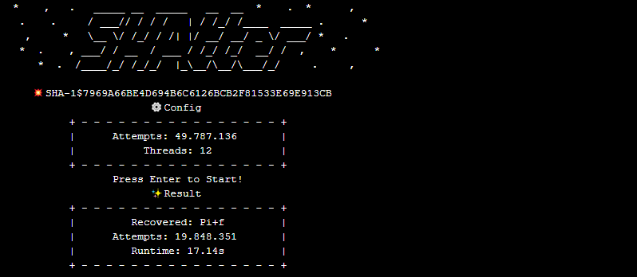
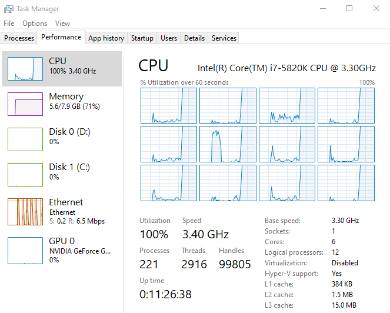

# SHAtter Password Recovery - A Multi-Threaded Brute Force and Dictionary Attack on Unsalted SHA1
This Program will Brute-Force any SHA1-Hash you pass, give it a target, press enter and forget about it until it found a solution. The Algorithm is using an optimized Charset based on Probability Analysis and CryptoPP for fairly fast Hash Computation, as well as Guess Ranges to support a starting and ending point for an attack with very elegant String Projection. If you rather run a word list, that is supported as well, even when it's restricted to being single-threaded for now, but a combination of dictionary words with Brute-Force parts is in the works too.


---
**NOTE**

The screenshot is from the newer SHAtter v0.2 

---

## Summary
  1. Permutation of Charset and String Projection.
  2. Implementation of String Increment and Ranges.
  3. Supported Dictionary Attacks
  4. SHA1 Computation of Guesses.
  5. Notes

## Charset and String Projection
```c
std::array< char, CHARSETSIZE > charset = {
	' ','0','1','2','3','4',
	'5','6','7','8','9','a',
	'b','c','d','e','f','g',
	'h','i','j','k','l','m',
	'n','o','p','q','r','s',
	't','u','v','w','x','y',
	'z','A','B','C','D','E',
	'F','G','H','I','J','K',
	'L','M','N','O','P','Q',
	'R','S','T','U','V','W',
	'X','Y','Z','.','!','*',
	'@','-','_','$','#',',',
	'/','+','?',';','%','~',
	'=','&','[',']','(',')'
};
```
The way a String can be represented in the Algorithm is very convenient as from above Alphabet with a bit of math we can express each unique String as unique Number to exactly represent that String. All that's needed is the Character itself as index multiplied by the base of that Character to shift it to a specific place in the String. For Example: If we wanted to represent **"abcd"** where **I** is the index of the Character and **S** the size of the Alphabet.


This allows us to easily continue the computation from where we left of, since the iteration of the algorithm gives us enough information to recreate a String, even with a starting point, since all we need is to subtract it, and it also allows for very specific ranges where the amount of guesses can be chosen based on the permutation of Characters. For Example: If we wanted to check for a password of a fixed length all that's needed is **S** to the power of the length, assuming the starting point is **0**.

## Implementation of String Increment
```c
// Reverse lookup for charset
std::array< unsigned int, 128 > reverseLookup( std::array< char, CHARSETSIZE >& charset ) {
	std::array< unsigned int, 128 > charset_reverse;
	std::fill( charset_reverse.begin(), charset_reverse.end(), 0 );
	for( int i = 0; i < CHARSETSIZE; ++i ) {
		charset_reverse[ ( int )charset[ i ] ] = i;
	}
	return charset_reverse;
}
```
In order to increment the String we need to build a reverse lookup on the used Alphabet, that will help because getting to the next Character is equal to incrementation of the Character's Index, but we're not done yet, because what if we're dealing with the last Character of the Alphabet? A reset is necessary as well, because we can't keep incrementing the same Character or we will end up just testing one letter passwords.
```c
// Reset all last characters
for( i = 0; i < value.size(); ++i ) {
	if( value[ i ] != charset[ CHARSETSIZE - 1 ] )
		break;
	else
		value[ i ] = charset[ 0 ];
}

// Increment character after resetting
value[ i ] = charset[ charsetr[ value[ i ] ] + 1 ];
```
This is already enough to produce guesses for the Brute-Force and define Ranges for Multi-threaded execution, since multiple instances should never check for the same guess.

## Supported Dictionary Attacks
Right now dictionaries are partly supported, because they can only be executed single-threaded, but I noticed for an example like rockyou.txt it's good enough, feel free to pick any other that fits your case.
[Password dictionaries](https://wiki.skullsecurity.org/Passwords)
```c
// Single-threaded dictionary attack
dictSHAker( "6A9F6C3FFF9581A22EF10CABD544143E37C61B4F", 14344326, 1, "rockyou.txt" );
// Passwords have to be seperated by \n
// Guesses equals to amount of lines read from dictionary
std::cin.get();
```
## SHA1 Computation of Guesses
This is fairly straightforward, the computation is based on Crypto++ library, which is unfortunately not the most performant based on some research from myself, but it's enough to achieve what we're lookig for.
```c
testhash.clear();
CryptoPP::StringSource( value.c_str(), true, new CryptoPP::HashFilter( sha1,
new CryptoPP::HexEncoder( new CryptoPP::StringSink( testhash ) ) ) );
if( strcmp( hash.c_str(), testhash.c_str() ) )
	continue;
else return value;
```
There is one last thing I'd like to talk about, which is how to initialize each thread, because the ranges are calculated based on the amount of guesses divided by the amount of threads, so the result always has to be integer to not run into any trouble, from then on starting and ending points are automatically picked by calculating the String representation of the iteration the the last thread leaves of, which is starting String as number plus amount of guesses, easy as cake.
```c
// Multi-threaded Brute Force attack
// Permutation of characters can be used as guesses
// Assume 1-4 character password for hash (CHARSLEN^4)-1
bruteSHAker( "7969A66BE4D694B6C6126BCB2F81533E69E913CB", 49787136, THREADS, charset );
std::cin.get();
```

## Notes
As always use this program with caution, the program is insanely fast when it comes to hash cracking, even with the limitations of Crypto++ Pipelines. On my processor the stats are very satisfying, you can even watch the guesses live with verbose if you wanted to.

| Hashes      | Threads      | Processor                     | Average of five |
| ----------- | ------------ | ----------------------------- | --------------- |
| 10.000.000  | 12           | Intel i7-5820K@3.30 GHz       | 7.865s          |

Keep the CPU Usage in mind when working with this, feel free to adjust the threads and guesses however you want to, I will continue working on dictionaries as well as maybe Prefix Word Lists with Brute-Force Suffix.

